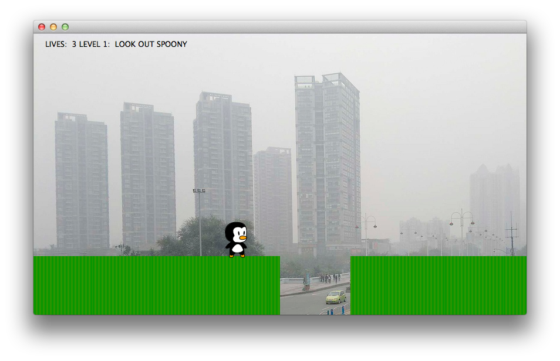

#Snoopy

This is a project to study animations, testing and game development in Qt.
Includes Qt Creator project file.

Test automation with QTestLib and [Cucumber](http://cukes.info/) + [Testability Driver](http://projects.developer.nokia.com/Testabilitydriver)

The game itself attempts to recreate the classic C64 game Snoopy. Even though it's unfinished, it's playable :)

Animation for Snoopy provided by: GameCreator /allegro.cc

